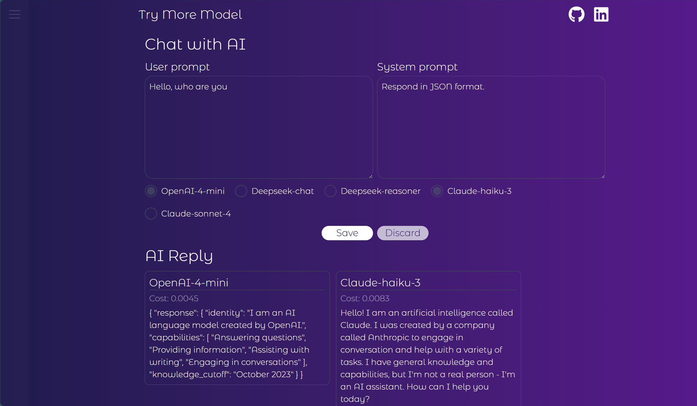
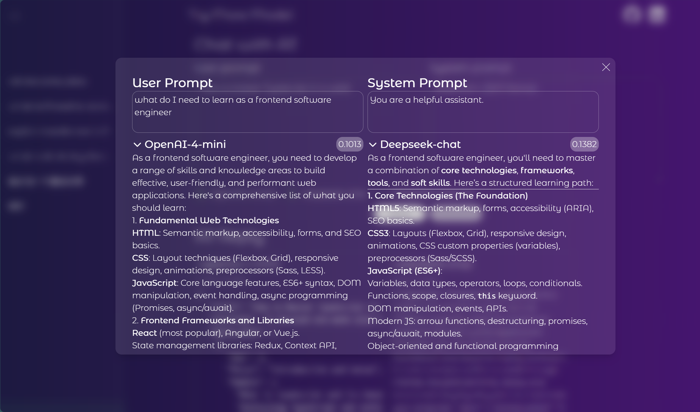

# Try More Model

An application for testing and comparing responses from multiple AI models at the same time.

## Project Overview

This project provides a unified interface that allows you to send the same prompt to multiple AI models simultaneously and compare their responses side by side. It supports multiple models from OpenAI, Deepeek and Anthropic.
|  |  |
| ----------------------------------------------- | ------------------------------------------------- |

## Tech Stack

### Frontend

- React 19
- Vite
- Tailwind CSS
- Zustand (state management)
- React Markdown (Markdown rendering)

### Backend

- FastAPI
- LiteLLM (unified AI model interface)
- Python

## Supported Models

- OpenAI GPT-4-mini
- DeepSeek Chat
- DeepSeek Reasoner
- Claude-haiku-3
- Claude-sonnet-4

## Quick Start

### Requirements

- Node.js (frontend)
- Python 3.x (backend)

### Install Dependencies

#### Frontend

```bash
cd frontend
npm install
```

#### Backend

```bash
cd backend
pip install fastapi uvicorn litellm python-dotenv openai
```

### Environment Variables

Create a `.env` file in the `backend` directory:

```env
OPENAI_API_KEY=...
DEEPSEEK_API_KEY=...
ANTHROPIC_API_KEY=...
```

### Run the Project

#### Start the Backend Server

```bash
cd backend
python -m uvicorn main:app --reload
```

The backend service runs by default at `http://localhost:8000`.

#### Start the Frontend Development Server

```bash
cd frontend
npm run dev
```

The frontend application runs by default at `http://localhost:5173`.

## Project Structure

```
.
├── backend/          # FastAPI backend service
│   └── main.py      # Backend entry file
├── frontend/         # React frontend application
│   ├── src/
│   │   ├── components/  # React components
│   │   ├── stores/     # Zustand state management
│   │   └── utils/      # Utility functions
│   └── package.json
└── README.md
```

## Features

- Send requests to multiple models simultaneously
- Compare responses from different models side by side
- Support custom system prompts
- Render responses in Markdown format
- Display cost information for each request

## Development

### Frontend Development

```bash
cd frontend
npm run dev      # Start development server
npm run build    # Build for production
npm run lint     # Run linting
```

### Backend Development

```bash
cd backend
uvicorn main:app --reload  # Start development server (with hot reload)
```

## License

MIT

---
